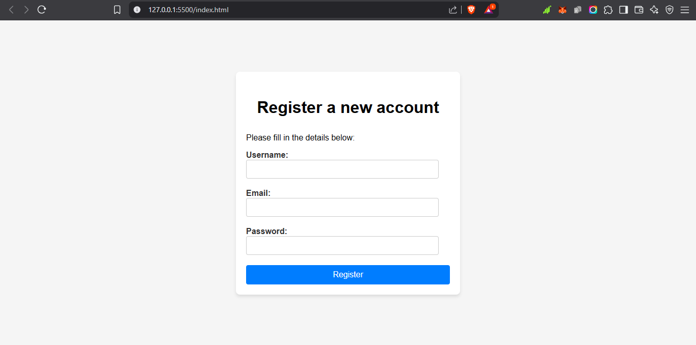

# User Registration Form – ALX Project

This project is a simple user registration form built with HTML, CSS, and JavaScript. It demonstrates basic client-side form validation using JavaScript string methods and conditions.

## Features

- Responsive registration form
- Client-side validation for username, email, and password fields
- Real-time feedback for validation errors or successful registration

## Validation Criteria

- **Username:** Must be at least 3 characters long
- **Email:** Must contain both `@` and `.`
- **Password:** Must be at least 8 characters long

## How It Works

1. User fills in the registration form.
2. On submission, JavaScript validates the input fields.
3. If all validations pass, a success message is displayed.
4. If any validation fails, specific error messages are shown.

## Files

- `index.html` – Main HTML file containing the form structure
- `style.css` – CSS file for styling the form
- `script.js` – JavaScript file handling form validation
- `README.md` – Project documentation

## Getting Started

1. Clone this repository:
    ```sh
    git clone https://github.com/Dorwu-Gabriel/Form-Creation-Validation
    ```
2. Open the project folder.
3. Open `index.html` in your browser to use the form.

## Screenshot

```markdown

```

## Author

This project was completed as part of the ALX Software Engineering program.

---